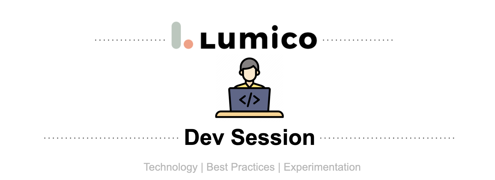

------

------

## Welcome 

We're connecting a chatbot with a face classification app. In this session we'll be using Python as our language, Keras and Tensorflow for face classification, and Google's DialogFlow for our chatbot.

## Required Software
* Postman: [download link](https://www.postman.com/downloads/)
* Ngrok: Run `brew install ngrok`
* Various Python libraries (see specifics instructions for each app)

## TensorFlow Keras Facial Analysis Application
### Set up project
* Navigate to the app: `cd tensorflow-keras-facial-analysis`
* Tensorflow: `pip3 install tensorflow`
* Other requirements: `pip3 install -r requirements.txt`
* Run the app: `python3 demo.py` (this also downloads the ML models the first time you run it)

## DialogFlow Chatbot
### API Application
* Navigate to the app: `cd dialogflow-chatbot-api`
* `pip3 install flask flask-restful`
* To run the app: `python api.py`
### Set up Dialogflow
* Go to the [DialogFlow console](https://dialogflow.cloud.google.com/).
* Ensure you are able to create an <b>Agent</b> with an <b>Intent</b> and <b>Fulfillment</b>.